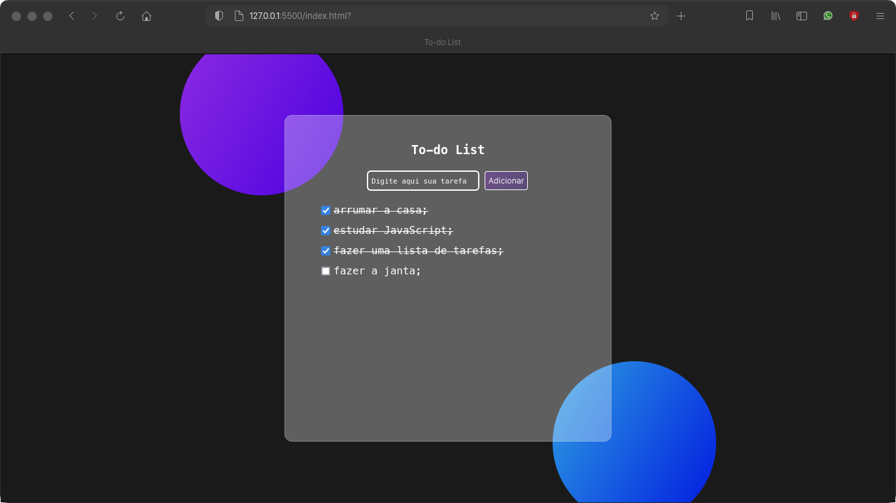

# To-do List

> Projeto front-end de lista de tarefas simples.

> Teste o site:
> [InstaClone](https://artaugusto.github.io/To-do-List/)

## 📝 Licença

Esse projeto está sob licença. Veja o arquivo [LICENÇA](LICENSE) para mais detalhes.

[⬆ Voltar ao topo](#DoctorCare)
